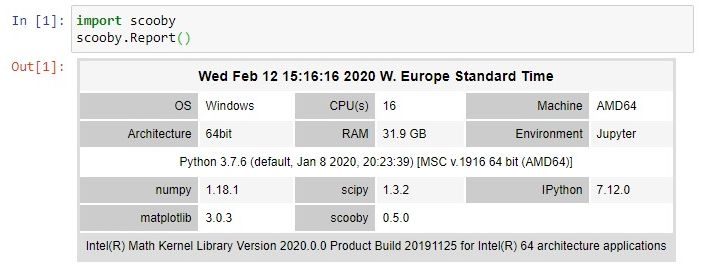

# scooby

[](https://travis-ci.org/banesullivan/scooby)
[](https://pypi.org/project/scooby/)


A Great Dane turned Python environment detective

This is a toolset to easily report your Python environment's package versions
and hardware resources.



Scooby has HTML formatting for Jupyter notebooks and rich text formatting for
just about every other environment. We designed this module to be lightweight
such that it could easily be added as a dependency to Python projects for
environment reporting when debugging. Simply add `scooby` to your dependencies
and implement a function to have `scooby` report on the aspects of the
environment you care most about.

Is `scooby` unable to detect aspects of an environment that you'd like to know?
We absolutely welcome feature requests and pull requests, so let us know what
you think!

This work is derived from [Dieter Werthmuller](https://github.com/prisae)'s work
towards creating a version reporting tool for the [empymod](https://github.com/empymod/)
and [SimPEG](https://github.com/simpeg/) projects.
This package has been altered to create a lightweight, pure Python
implementation with no non-standard dependencies so that it can easily be used
as an environment reporting tool in any Python library with minimal impact.

## Usage

```py
>>> import scooby
>>> scooby.investigate()

------------------------------------------------------
  Date: Tue Jun 25 16:17:46 2019 MDT
  Platform: Darwin-18.5.0-x86_64-i386-64bit

             12 : CPU(s)
         x86_64 : Machine
          64bit : Architecture
        32.0 GB : RAM

  3.7.3 | packaged by conda-forge | (default, Mar 27
  2019, 15:43:19)  [Clang 4.0.1
  (tags/RELEASE_401/final)]

         1.16.3 : numpy
          1.3.0 : scipy
          7.5.0 : IPython
          3.1.0 : matplotlib

  Intel(R) Math Kernel Library Version 2018.0.3
  Product Build 20180406 for Intel(R) 64
  architecture applications
------------------------------------------------------
```

But you can also add addtional packages too if you'd like via the `addtional`
keyword argument:

```py
>>> scooby.investigate(additional='pyvista')

------------------------------------------------------
  Date: Tue Jun 25 16:18:01 2019 MDT
  Platform: Darwin-18.5.0-x86_64-i386-64bit

             12 : CPU(s)
         x86_64 : Machine
          64bit : Architecture
        32.0 GB : RAM

  3.7.3 | packaged by conda-forge | (default, Mar 27
  2019, 15:43:19)  [Clang 4.0.1
  (tags/RELEASE_401/final)]

         1.16.3 : numpy
          1.3.0 : scipy
          7.5.0 : IPython
          3.1.0 : matplotlib
         0.20.4 : pyvista

  Intel(R) Math Kernel Library Version 2018.0.3
  Product Build 20180406 for Intel(R) 64
  architecture applications
------------------------------------------------------
```

Or maybe you want a whole bunch of additional packages:

```py
>>> scooby.investigate(additional=['pyvista', 'vtk', 'appdirs',])

------------------------------------------------------
  Date: Tue Jun 25 16:18:16 2019 MDT
  Platform: Darwin-18.5.0-x86_64-i386-64bit

             12 : CPU(s)
         x86_64 : Machine
          64bit : Architecture
        32.0 GB : RAM

  3.7.3 | packaged by conda-forge | (default, Mar 27
  2019, 15:43:19)  [Clang 4.0.1
  (tags/RELEASE_401/final)]

         1.16.3 : numpy
          1.3.0 : scipy
          7.5.0 : IPython
          3.1.0 : matplotlib
         0.20.4 : pyvista
          8.2.0 : vtk
          1.4.3 : appdirs

  Intel(R) Math Kernel Library Version 2018.0.3
  Product Build 20180406 for Intel(R) 64
  architecture applications
------------------------------------------------------
```
